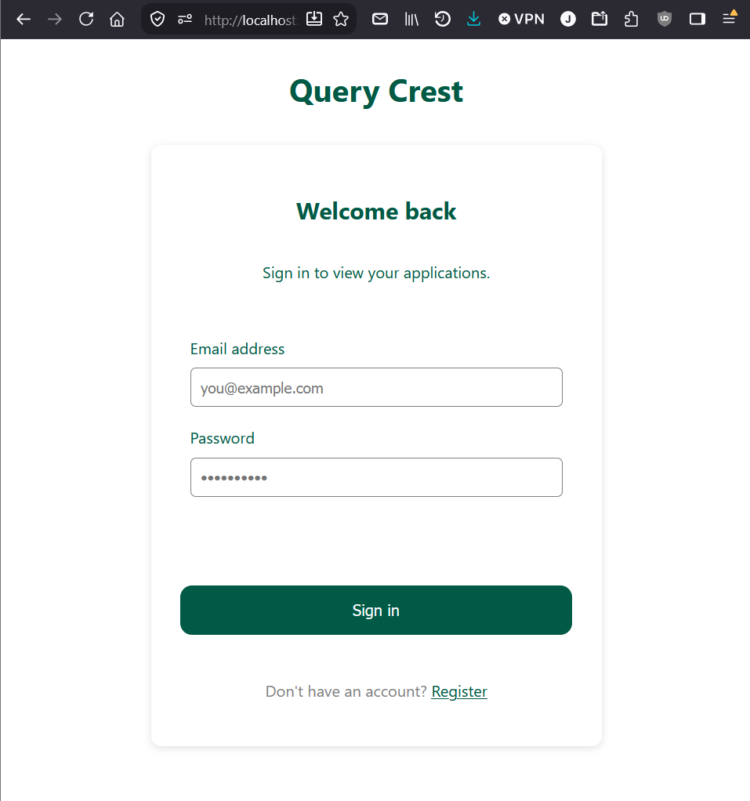
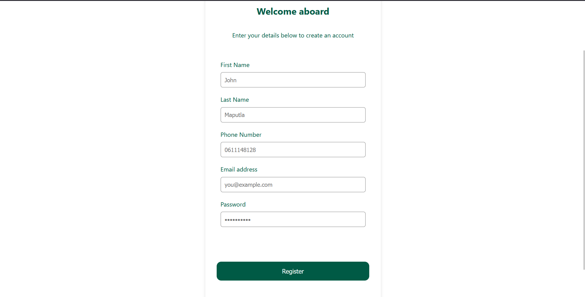
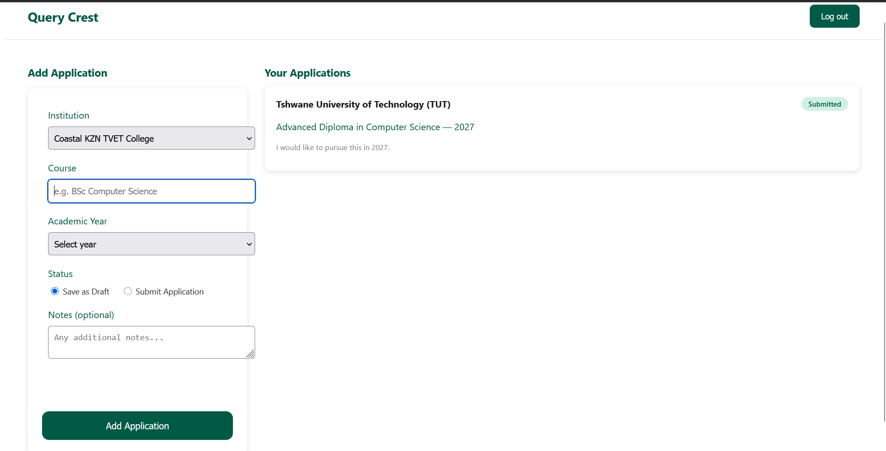

# QueryCrest

QueryCrest is a student application-tracking dashboard for South African tertiary institutions. Users register and sign in, then manage a personal list of institution applications — saving drafts or marking them as formally submitted — from a single dashboard.

## Project Description

The app is split into two pages:

- **`index.html`** — combined login and sign-up page (one HTML file, JS toggles between the two forms). Handles account registration, email confirmation, and login.
- **`dashboard.html`** — the application manager. Guards access behind a stored session token, loads the user's existing applications on page load, and lets them add new ones against a fixed list of approved institutions.

All authentication and data-mutating logic runs server-side in Supabase Edge Functions rather than directly from the browser, so RLS policies and validation are enforced consistently regardless of what the client sends.

**Frontend (Vite + vanilla JS)**
- `index.html` / `auth.js` — registration and login forms, client-side validation as a first layer, calls `auth-handler` for all auth actions.
- `dashboard.html` / `dashboard.js` — checks for a stored session token before rendering anything, calls `applications-handler` to load and add applications.
- `supabaseClient.js` — single shared Supabase client instance used across the frontend.

**Edge Functions (Deno, deployed to Supabase)**
- `auth-handler` — handles `register` and `login` actions. Creates the Supabase Auth user, and logs every login attempt (success or failure) to `login_attempts` using the service role key.
- `applications-handler` — handles `load` and `add` actions for a user's applications. Runs with the caller's own JWT (not the service role key) so Postgres RLS enforces that a user can only see and insert their own rows. Validates the institution field server-side against a fixed approved list, regardless of what the frontend sends.

**Database**
- `profiles` — one row per user, populated automatically via a Postgres trigger on `auth.users` (`security definer`, bypasses RLS) so profile creation doesn't depend on the client having an active session yet.
- `applications` — one row per application; RLS restricts each user to their own rows.
- `login_attempts` — internal login audit log; RLS enabled with no client-facing policies, written only via the service role key inside `auth-handler`.

## Setup Instructions

### Prerequisites
- Node.js and npm
- [Supabase CLI](https://supabase.com/docs/guides/cli)
- A Supabase project (see project URL below)

### 1. Install dependencies
```bash
npm install
```

### 2. Environment variables
Create a `.env` file in the project root:
```
VITE_SUPABASE_URL=https://jgjsmxvwexnmuydumhpx.supabase.co
VITE_SUPABASE_ANON_KEY=<your anon key, from Supabase Dashboard → Settings → API>
```

### 3. Link and deploy Edge Functions
```bash
supabase login
supabase link --project-ref jgjsmxvwexnmuydumhpx
supabase functions deploy auth-handler
supabase functions deploy applications-handler
```
`SUPABASE_URL`, `SUPABASE_ANON_KEY`, and `SUPABASE_SERVICE_ROLE_KEY` are injected automatically into Edge Functions by Supabase — no manual secrets setup required.

### 4. Database setup
Run the SQL for the `profiles` trigger, `applications` table + RLS policies, and `login_attempts` table (see `/supabase` migrations or the project documentation) in the Supabase SQL editor.

### 5. Run the frontend locally
```bash
npm run dev
```
Open the printed local URL (typically `http://localhost:5173`).

### 6. Supabase Auth redirect settings
In Supabase Dashboard → Authentication → URL Configuration, set:
- **Site URL** to your local dev URL (or your deployed Vercel URL in production)
- **Redirect URLs** to include that same URL with a `/**` wildcard

## Supabase Project URL

```
https://jgjsmxvwexnmuydumhpx.supabase.co
```

## Screenshots


### Login / Sign-Up (`index.html`)



### Dashboard (`dashboard.html`)
